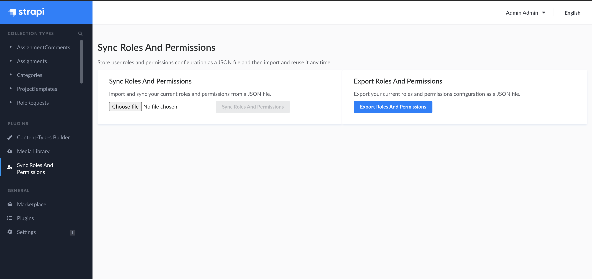

# strapi-plugin-sync-roles-permissions

[](https://www.npmjs.com/package/strapi-plugin-sync-roles-permissions)

Store your user roles and permissions for later.



## Motivation

Sometimes our applications require lots of different types of users with a lot of different permissions. Strapi with it's `strapi-plugin-users-permissions` gives us a lot of functionalities out of the box, which is great. However, it would be nice to be able to store the roles and permissions configuration in order to be able to share it across multiple db's. It is especially useful during development so we don't have to configure it every time.

With this plugin we can store existing roles and permissions configuration as a JSON file at any point of time, and then whenever we need to update the application with the given configuration we can just upload the same JSON file and everything will be set up.

## Installation

#### 1.

This plugin is build on top of the official `strapi-plugin-users-permissions` plugin, so make sure it is already enabled.

#### 2.

Install with npm:

```
npm install --save strapi-plugin-sync-roles-permissions
npm run build
```

Install with yarn:

```
yarn add strapi-plugin-sync-roles-permissions
yarn build
```

#### 4.

Start your strapi server.

## LICENSE

MIT
